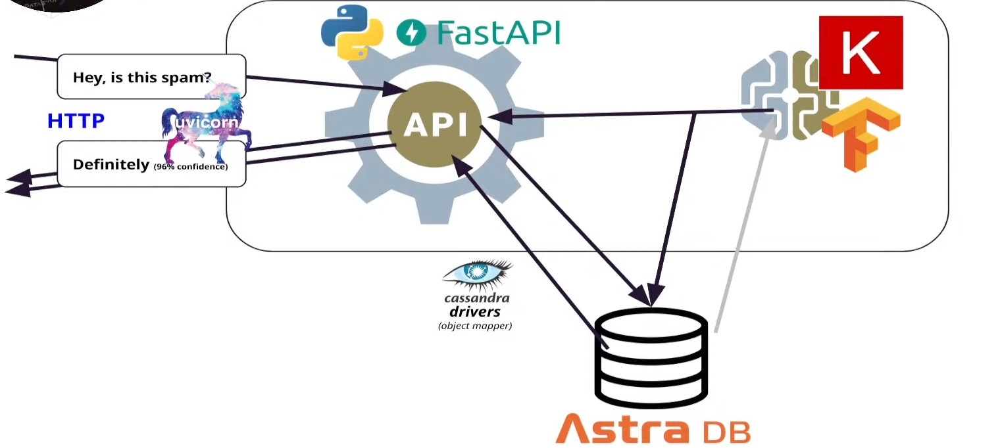
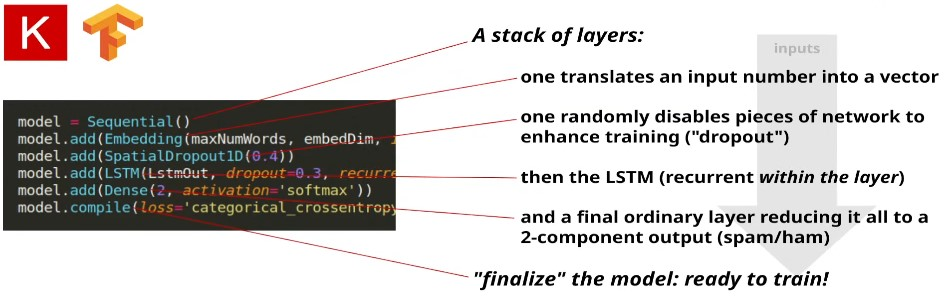
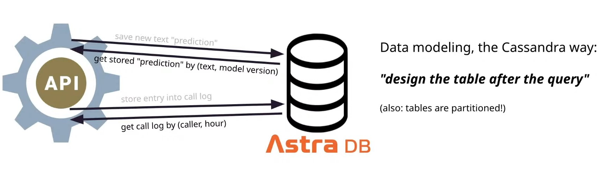
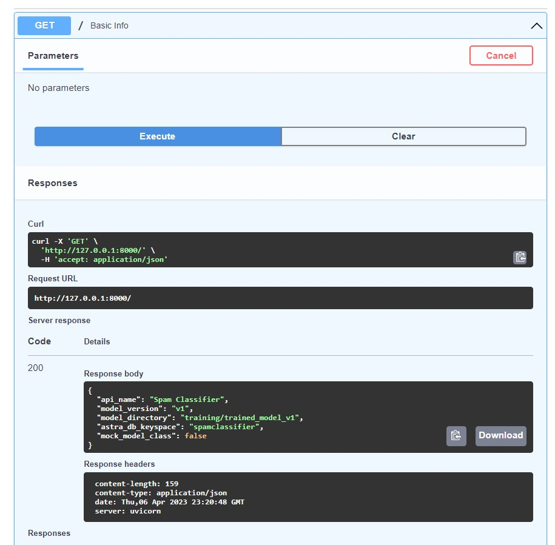

# ML Text classifier with Restful API

<!-- Time: *50 minutes*. Difficulty: *Intermediate*. -->


### Objectives: 
Learn to build your own NLP text classifier and expose it as an API using the following technologies:

- AI-based text analysis with Tensorflow/Keras;
- Astra DB, a Database-as-a-Service built on Apache Cassandra®;
- FastAPI, the high-performance Python framework for creating APIs;
- Many useful Python libraries and packages including `pandas`, `pydantic`, `dotenv`, `sklearn`, `uvicorn`, and more.

### Main Topics:

- prepare the labeled dataset for model training;
- train the model to classify any input text;
- export the trained model and test it interactively;
- create your free NoSQL database for data storage;
- set up and start an API exposing the classifier as a reusable class;
- learn how to speed up the API with DB-based caching;
- inspect how a streaming response is handled in the API.

### Instructions and Explanation:
#### 1. Create a database in Astra DB
You will now create a database with a keyspace in it (a keyspace can contain tables). The API needs a couple of tables for persistent storage: they will be created programmatically on startup if they don't exist, so there's no need to worry too much about them.

Besides creating the database, you need to retrieve a token, that is, a set of credentials used later to connect to it in a secure and authenticated way.

Generate and retrieve a DB Token. **Important:** use the role "DB Administrator" for the token. Save the token in a secure place for later use. Note: the token auto-generated while creating the database has not enough permissions for our purposes today, you can disregard it.

#### 2. Train the model
Inspect the starting dataset, open the file training/dataset/spam-dataset.csv and have a look at the lines there.
```
label,text,source
ham,"Go until jurong point, crazy.. Available only in bugis n great world la e buffet... Cine there got amore wat...",sms-spam
ham,Ok lar... Joking wif u oni...,sms-spam
spam,Free entry in 2 a wkly comp to win FA Cup final tkts 21st May 2005. Text FA to 87121 to receive entry question(std txt rate)T&C's apply 08452810075over18's,sms-spam
```
Data is labeled in 3 columns where we need just the first two columns.

The third column betrays the mixed origin of the data: in order to create a labeled dataset of around 7.5K messages marked as spam/ham, two different (publicly available) sets have been merged (namely this one and this one, made available by the [UCI Machine Learning Repository](https://archive.ics.uci.edu/ml/index.php)).



#### 2.a Prepare the dataset for training
You want to "teach" a machine to distinguish between spam and ham: unfortunately, machines prefer to speak numbers rather than words. You then need to transform the human-readable CSV file above into a format that, albeit less readable by us puny humans, is more suited to the subsequent task of training the classifier. You will express (a cleaned-out version of) the text into a sequence of numbers, each representing a token (one word) forming the message text.

More precisely:

first you'll initialize a "tokenizer", asking it to build a dictionary (i.e. a token/number mapping) best suited for the texts at hand;
then, you'll use the tokenizer to reduce all messages into (variable-length) sequences of numbers;
these sequences will be "padded", i.e. you'll make sure they end up all having the same length: in this way, the whole dataset will be represented by a rectangular matrix of integer numbers, each row possibly having leading zeroes;
the "spam/ham" column of the input dataset is recast with the "one-hot encoding": that is, it will become two columns, one for "spamminess" and one for "hamminess", both admitting the values zero or one (but with a single "one" per row): this turns out to be a formulation much friendlier to categorical classification tasks in general;
finally you'll split the labeled dataset into a "training" and a "testing" disjoint parts. This is a very important concept: the effectiveness of a model should always be validated on data points not used during training.


All these steps can be largely automated by using data-science Python packages such as pandas, numpy, tensorflow/keras.

The above steps are accomplished by running a Jupyter interactive notebook (which you should inspect closely to learn more) as described below. In this way, you can run the steps one at a time and explore the contents of the variables you create, for a better understanding of the transformations being applied to the data.

#### 2.b Train the neural network (RNN with LSTM)

It is time to train the model, i.e. fit a neural network to the task of associating a spam/ham label to a text message. Well, actually the task is now more like "associating probabilities for 0/1 to a sequence of integer numbers (padded to fixed length with leading zeroes)".

The code for creating and training the model is very short (a handful of lines of code, excluding loading from disk and writing to it), but running it will take several minutes: launch the script

```python trainModel.py```

and wait for it to finish (it will take probably eight minutes or so on Gitpod, possibly more on your own computer, depending on the specs).

The training script works as follows:

all variables created and stored in the previous steps are loaded back to memory;
a specific architecture of a neural network is created, still a "blank slate" in terms of what it "knows". Its core structure is that of a LSTM (long-short-term-memory), a specific kind of recurrent neural network with some clever modifications aimed at enhancing its ability to "remember" things between non-adjacent locations in a sequence, such as two displaced positions in a string of text;
the network (your classifier) is trained: that means it will progressively adapt its internal (many thousands of) parameters in order to best reproduce the input training set. Each individual neuron in the network is a relatively simple component - the "intelligence" coming from their sheer quantity and the particular choice of parameters determining which neurons affect which other and by how much;
Once the training process has finished, the script carefully saves everything (model, tokenizer and associated metadata) in a format that can be later loaded by the API in a stand-alone way.

Take a look in the output directory (ls training/trained_model_v1) to find:

- a (small) JSON file with some metadata describing some features of the model;
- a (larger) JSON file containing the full definition of the tokenizer. This has been created, and will be loaded, using helper functions provided with the tokenizer itself for our convenience;
- a (rather large) binary file containing "the model". That means, among other things, the shape and topology of the neural network and all "weights", i.e. the parameters dictating which neurons will affect which others, and by how much. Saving and loading this file, which is in the HDF5 format, is best left to routines kindly offered by Keras.



#### 2.c Test the trained model

Before moving on to the API section, make sure that the saved trained model is self-contained: that is, check that by loading the contents of training/trained_model_v1, and nothing else, you are able to perform meaningful estimates of the spam/ham status for a new arbitrary piece of text.

The script loadTestModel.py does exactly that: it loads the saved model and uses that to "predict" the ham/spam labels for new texts. Try it with

```python loadTestModel.py```

or even, if you feel creative, something like

```python loadTestModel.py```
 This is my example sentence and let us see if this is ham

Note that the output is given in terms of "probabilities", or "confidence": one can interpret a result like ```{'ham': 0.92, 'spam': 0.08}``` as meaning the input is ham with 92% confidence. Indeed, generally speaking, ML-based classifiers are very sophisticated and specialized machines for statistical inference.

If you look at the (very simple) code of this function, you will see how the model, once loaded, is used to make predictions (it all boils down to the model's predict method, but first the input text must be recast as sequence of numbers with the aid of the tokenizer, and likewise the result must be made readable by humans again).

#### Expose the API
Now your model is trained and saved to disk, ready to be used. It is time to expose it with FastAPI in the form of easy-to-use HTTP requests.

You'll first look at a minimal version of the API, just to get a taste of how FastAPI works, and then turn to a full-fledged version, with more endpoints and a database-backed caching layer.

Now you need to prepare a configuration file to give the API all required parameters to connect to the database. Fortunately, the Astra CLI has you covered and will automate most of it for you: all you need is to run a couple of commands.

First, configure the Astra CLI so that it knows the "token" part of your DB Admin Token (i.e. the string starting with AstraCS:...):
``` 
astra setup
```
You can test that everything works by inspecting your database:
```
astra db get <name-of-DB>
```



#### Inspect the full API
```
uvicorn api.main:app
```

The full API is starting (and again, after a somewhat lengthy output you will see something like Uvicorn running on http://127.0.0.1:8000 being printed).

You could play a bit more with the API, but to do so, let us move to a friendlier interface, offered for free by FastAPI: the Swagger UI.

### Use the API

Open the Swagger UI
In principle, you could access the Swagger UI by visiting http://127.0.0.1:8000/docs. If you are running locally that's the URL you should open, end of story.

Fun with caching
Let's have some fun with the caching mechanism and the multiple-text endpoint. For this experiment you will borrow a few lines from a famous poem by T. S. Eliot.

First locate the /predictions endpoint, expand it and click "Try it out" to access the interactive form. Edit the "Request Body" field pasting the following:
```
{
  "texts": [
    "I have seen them riding seaward on the waves",
    "When the wind blows the water white and black."
  ]
}
```




#### Prerequisites:

- Familiarity with Python;
- A Github account is required for the hands-on.
